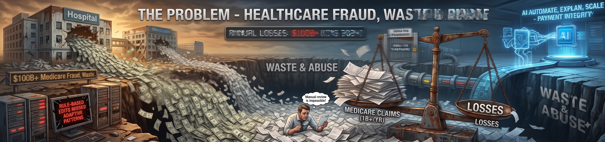
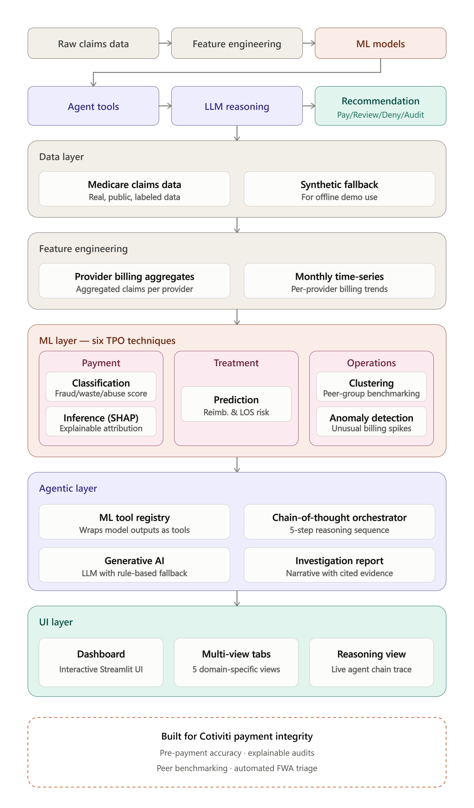
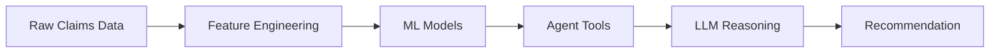
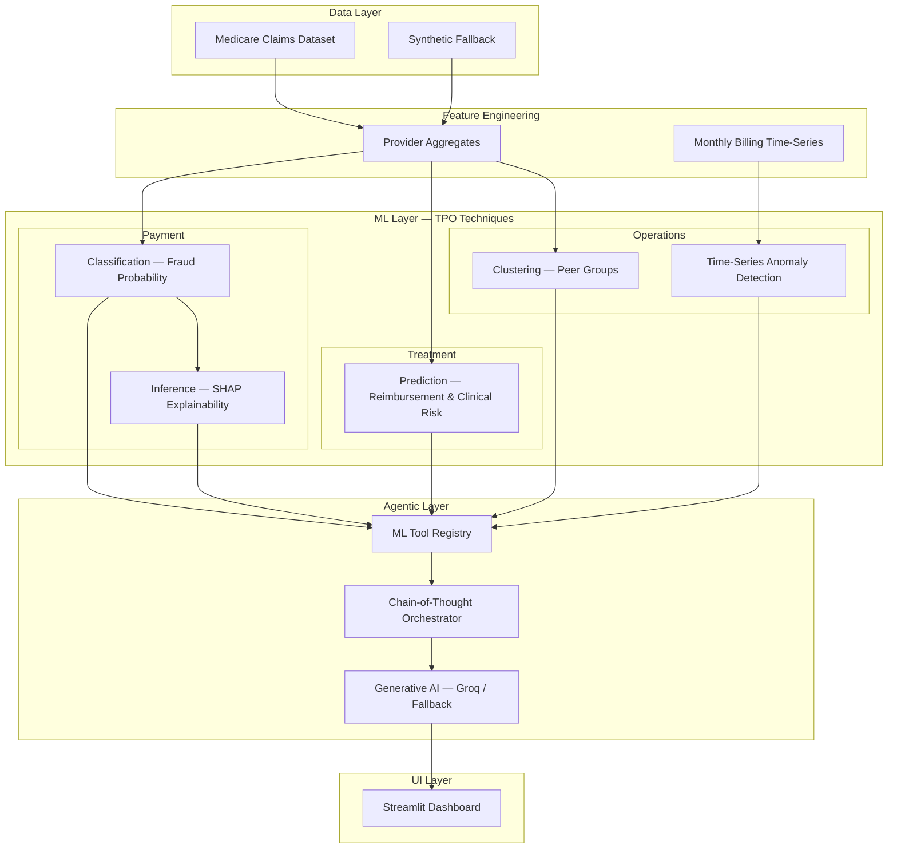

# TPO Sentinel – Clinical Decision Making & Payment Integrity POC

> **Cotiviti Intern Assessment – Topic #2**  
> Clinical Decision Making and Pattern Recognition in Health Care: Chain Reasoning, Agentic Generative AI, Classification, Prediction, Inference, Clustering, & Time-Series Anomaly Detection for Treatment, Payment & Operations (TPO)

---

## What This Is

**TPO Sentinel** is a Streamlit-based agentic demonstrator that combines six machine-learning techniques with a chain-of-thought Investigator Agent to produce explainable payment-integrity decisions on healthcare claims data. It maps each technique to one of Cotiviti's core pillars:

| Pillar | Technique | Implementation |
|---|---|---|
| **Payment** | Classification | XGBoost FWA fraud classifier |
| **Payment** | Inference | SHAP global/local explainability |
| **Treatment** | Prediction | Regression – expected reimbursement & risk score |
| **Operations** | Clustering | KMeans provider peer-group segmentation |
| **Operations** | Time-Series Anomaly Detection | STL + IsolationForest + z-score on monthly billing |
| **All** | Agentic Chain Reasoning | LLM-driven (or fallback) Investigator Agent |

---

## Submission Deliverables

| Deliverable | Location |
|---|---|
| Written report (APA, Word) | [deliverables/report/Report.docx](deliverables/report/Report.docx) |
| Slide presentation | [deliverables/slides/Presentation.pptx](deliverables/slides/Presentation.pptx) |
| Video presentation | [Google Drive](https://drive.google.com/file/d/1_XJzK0Mzv2tU3zJYSm5Mi-hVmVDJgviv/view?usp=sharing) |
| POC demo code | This repository (`src/`, `scripts/`) |
| Live dashboard | [https://tpo-poc-agent.streamlit.app/](https://tpo-poc-agent.streamlit.app/) |

### Problem statement



### System architecture



Interactive Mermaid diagrams and full layer breakdown: [docs/architecture.md](docs/architecture.md)

---

## Quick Start

### 1. Install dependencies

```bash
pip install -r requirements.txt
```

### 2. Configure environment (optional but recommended)

```bash
cp .env.example .env
# Edit .env with your API keys (app works without them)
```

### 3. Get the data

**Option A – Kaggle CLI (recommended)**

```bash
# Install kaggle CLI, set KAGGLE_USERNAME + KAGGLE_KEY in .env, then:
python src/data/download.py
```

**Option B – Manual download**

1. Go to https://www.kaggle.com/datasets/rohitrox/healthcare-provider-fraud-detection-analysis
2. Download all CSV files into `data/raw/`

**Option C – Synthetic data (no download needed)**

```bash
python src/data/synthetic.py
```

### 4. Train all models

```bash
python scripts/train_all.py
```

### 5. Launch the dashboard

```bash
streamlit run src/app/streamlit_app.py
```

---

## Project Structure

```
cotiviti-tpo-poc/
├── data/
│   ├── raw/            # raw CSVs (gitignored)
│   └── processed/      # features, trained models (gitignored)
├── src/
│   ├── config.py               # paths, constants, env loading
│   ├── data/
│   │   ├── download.py         # Kaggle dataset download
│   │   ├── synthetic.py        # synthetic fallback dataset
│   │   └── features.py         # feature engineering + time-series
│   ├── models/
│   │   ├── classification.py   # FWA fraud classifier (XGBoost)
│   │   ├── prediction.py       # reimbursement/risk regression
│   │   ├── clustering.py       # provider peer-group clustering
│   │   ├── anomaly.py          # time-series anomaly detection
│   │   └── inference.py        # SHAP explainability
│   ├── agent/
│   │   ├── llm.py              # hybrid LLM (API or fallback)
│   │   ├── tools.py            # ML tools callable by agent
│   │   └── agent.py            # chain-of-thought orchestrator
│   └── app/
│       └── streamlit_app.py    # multi-tab Streamlit dashboard
├── scripts/
│   ├── train_all.py            # train + persist all models
│   └── make_assets.py          # export charts as PNG
├── deliverables/
│   ├── report/Report.docx          # APA written report
│   └── slides/
│       ├── Presentation.pptx       # slide deck
│       ├── problemstaement.png     # problem overview figure
│       └── tpo_sentinel_architecture.png
├── docs/
│   ├── architecture.md             # Mermaid diagrams + TPO mapping
│   └── eraser-architecture-prompt.md
├── .env.example
├── requirements.txt
└── README.md
```

---

## Submission Checklist

After recording your video, run the following commands to publish:

```bash
cd path/to/cotiviti-tpo-poc
git init
git add .
git commit -m "Initial submission – Cotiviti TPO Sentinel POC"

# Create the GitHub repo (requires gh CLI)
gh repo create cotiviti-tpo-poc --public --source=. --remote=origin --push

# Add the Cotiviti evaluator as a collaborator
gh api repos/<YOUR_GITHUB_USERNAME>/cotiviti-tpo-poc/collaborators/jesus.hurtado --method PUT -f permission=read
```

Then send an email to **jesus.hurtado@cotiviti.com** with:

- **Subject:** `INTERN - <Your Full Name> - <Your University>`
- **Body:** Include the GitHub repository URL.

---

## Architecture

End-to-end flow:



Layered system (Payment · Treatment · Operations):



Full details, agent steps, and TPO mapping: [docs/architecture.md](docs/architecture.md).
