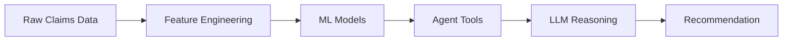
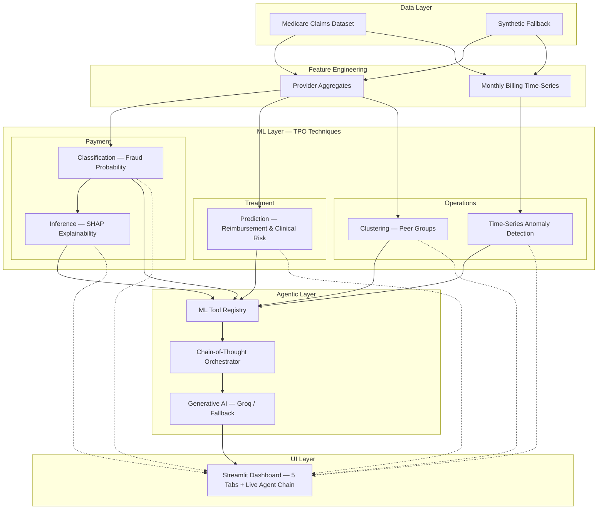

# TPO Sentinel – Architecture

## End-to-End Data Flow

## Layered Architecture

## Technique → TPO Mapping

| Technique | TPO Pillar | Description |
|---|---|---|
| Classification | Payment | XGBoost trained on provider/claim features; outputs P(fraud) |
| Inference (SHAP) | Payment | Explains *why* a claim is flagged with feature contribution values |
| Prediction (regression) | Treatment | Predicts expected reimbursement and clinical risk score |
| Clustering | Operations | Groups providers into peer cohorts; flags statistical outliers |
| Time-Series Anomaly | Operations | Detects unusual months in provider billing volume/amounts |
| Agentic Chain Reasoning | All | LLM orchestrates a 5-step investigation and writes a narrative recommendation |

## Agent Chain-of-Thought Steps

1. **Classify** – get fraud probability for provider/claim.
2. **Anomaly check** – query last 24 months for billing spikes.
3. **Peer compare** – locate provider's cluster; measure deviation from centroid.
4. **Explain** – pull top SHAP features driving the score.
5. **Synthesize** – generate final recommendation (Pay / Review / Deny / Audit) with cited evidence.
